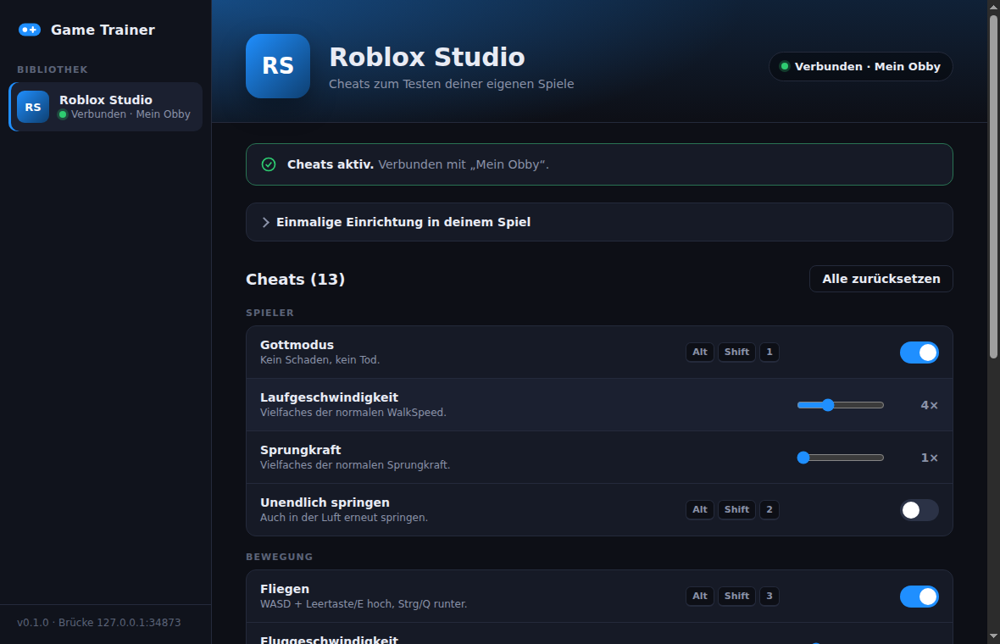

# Game Trainer

Ein Cheat-Menü im Stil von WeMod, gebaut mit Electron. Die App erkennt, welches
Spiel gerade läuft, und schaltet dann die passenden Cheats frei. Du bedienst sie
per Schalter, Regler und globalen Tastenkürzeln. Neue Spiele kommen als Module
dazu.



## Was ist drin?

| Spiel | Cheats |
|---|---|
| **Roblox Studio** (eigene Spiele testen) | Gottmodus, Laufgeschwindigkeit, Sprungkraft, Unendlich springen, Fliegen, Fluggeschwindigkeit, Durch Wände gehen, Schwerkraft, Immer hell, Heilen, Zum Spawn, Zur Mausposition, Neu spawnen |

> **Warum Roblox Studio und nicht das normale Roblox?**
> Cheats in Online-Spielen verstoßen gegen die Roblox-Regeln (Bann-Gefahr) und
> verderben anderen Spielern den Spaß. Deshalb unterstützt auch WeMod nur
> Einzelspieler-Spiele. In **Roblox Studio** testest du dein **eigenes** Spiel,
> und dort sind solche Test-Cheats ganz normal und erlaubt. Die Luau-Skripte
> prüfen `RunService:IsStudio()` und tun im veröffentlichten Spiel nichts.

## Starten

Voraussetzung: [Node.js](https://nodejs.org) 20 oder neuer.

```bash
cd game-trainer
npm install
npm start
```

Als einzelne `.exe` für Windows (portable):

```bash
npm run dist      # Ergebnis liegt in dist/
```

## Roblox Studio einrichten (einmal pro Spiel)

1. Spiel in Roblox Studio öffnen.
2. **Home → Game Settings → Security → „Allow HTTP Requests“** einschalten.
3. In **ServerScriptService** ein `Script` namens `DevTrainer` anlegen. In der App
   auf **Server-Skript → Kopieren** klicken und den Inhalt einfügen.
4. In **StarterPlayer → StarterPlayerScripts** ein `LocalScript` namens
   `DevTrainerClient` anlegen und das **Client-Skript** einfügen.
5. Spieltest starten (**F5**). Die App zeigt dann „Verbunden · <Spielname>“.

Die Skripte liegen auch unter `src/games/roblox-studio/roblox/`.

### So funktioniert's

```
┌──────────────┐  Prozess-Check alle 2 s   ┌──────────────────────┐
│ Game Trainer │ ─────────────────────────▶│ RobloxStudioBeta.exe │
│  (Electron)  │                           └──────────────────────┘
│              │  GET /v1/roblox-studio/state  (alle 0,3 s)
│  Brücke auf  │ ◀──────────────────────────  DevTrainer (Server-Script)
│ 127.0.0.1:   │                                  │ Attribute in
│   34873      │                                  ▼ ReplicatedStorage.DevTrainer
└──────────────┘                              DevTrainerClient (LocalScript)
```

- **Server-Skript:** Gottmodus, Tempo, Sprungkraft, Schwerkraft, Immer hell,
  Heilen, Zum Spawn, Neu spawnen.
- **Client-Skript:** Fliegen, Durch Wände gehen, Unendlich springen, Zur Mausposition.
- Wird die App geschlossen, schaltet das Skript nach etwa 3 Sekunden alle Cheats ab.

### Tastenkürzel

| Kürzel | Cheat |
|---|---|
| `Alt+Shift+1` | Gottmodus |
| `Alt+Shift+2` | Unendlich springen |
| `Alt+Shift+3` | Fliegen (WASD, Leertaste/E hoch, Strg/Q runter) |
| `Alt+Shift+4` | Durch Wände gehen |
| `Alt+Shift+5` | Immer hell |
| `Alt+Shift+6` | Heilen |
| `Alt+Shift+7` | Zum Spawn |
| `Alt+Shift+8` | Zur Mausposition |
| `Alt+Shift+9` | Neu spawnen |

Die Kürzel sind nur aktiv, solange das Spiel läuft, und funktionieren auch,
wenn Roblox Studio im Vordergrund ist.

## Ein neues Spiel hinzufügen

1. Kopiere `src/games/_vorlage` nach `src/games/<dein-spiel>`. Ordner mit `_`
   am Anfang werden ignoriert.
2. Passe in `index.js` Folgendes an: `id`, `name`, `processNames` (den
   `.exe`-Namen aus dem Task-Manager) und die `categories` mit den Cheats.
3. Lege fest, wie die Cheats ins Spiel kommen:
   - `bridge: true`: Ein Mod oder Skript im Spiel fragt
     `http://127.0.0.1:34873/v1/<id>/state` ab, so wie bei Roblox Studio.
   - Hooks `onAttach`, `onDetach`, `onChange` und `onTrigger`: Hier läuft
     beliebiger Node-Code, zum Beispiel um eine Konfig-Datei zu schreiben.
4. App neu starten. Das Spiel erscheint dann in der Bibliothek.

Cheat-Typen:

```js
{ id: 'fly',   name: 'Fliegen', type: 'toggle', hotkey: 'Alt+Shift+3' }
{ id: 'speed', name: 'Tempo',   type: 'slider', min: 1, max: 10, step: 0.5, default: 1, unit: '×' }
{ id: 'heal',  name: 'Heilen',  type: 'button', hotkey: 'Alt+Shift+6' }
```

Bitte nur Einzelspieler-Spiele oder eigene Projekte, keine Online-Multiplayer-Spiele.

## Entwickeln und testen ohne Spiel

```bash
npm test                                         # Unit-Tests (Kern, Brücke, Erkennung)
TRAINER_SIMULATE=RobloxStudioBeta.exe npm start  # tut so, als liefe Roblox Studio
npm run fake-studio -- "Mein Obby"               # simuliert das verbundene Studio-Skript
```

Unter Windows (PowerShell) geht das Simulieren so:
`$env:TRAINER_SIMULATE="RobloxStudioBeta.exe"; npm start`

## Aufbau

```
main.js                 Electron-Hauptprozess (Fenster, IPC, Tastenkürzel)
preload.js              sichere Schnittstelle für die Oberfläche
renderer/               Oberfläche (HTML/CSS/JS)
src/core/               Spiel-Erkennung, Brücke, Trainer-Logik
src/games/<spiel>/      ein Ordner pro Spiel
tools/fake-studio.js    Studio-Simulator zum Testen
test/                   Unit-Tests
```
